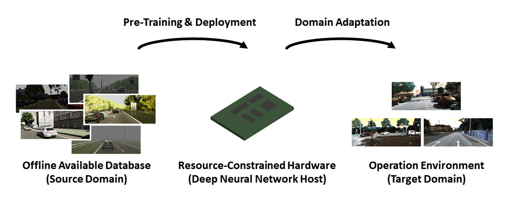

# Visual Domain Adaptation for Monocular Depth Estimation on Resource-Constrained Hardware

This repository contains the official implementation of our ICCV 2021 Workshop paper [Visual Domain Adaptation for Monocular Depth Estimation on Resource-Constrained Hardware](https://openaccess.thecvf.com/content/ICCV2021W/ERCVAD/papers/Hornauer_Visual_Domain_Adaptation_for_Monocular_Depth_Estimation_on_Resource-Constrained_Hardware_ICCVW_2021_paper.pdf).


## Requirements
Our code runs with the following packages:
* python=3.7
* pytorch=1.4.0 
* cudatoolkit=10.1
* ninja=1.10
* numpy=1.20
* setuptools=51.1
* six=1.15
* torchvision=0.5.0
* matplotlib=3.3
* pillow=7.0
* scipy=1.2

## Datasets 
For training and evaluating our models we make use of the datasets [NYU Depth V2](https://cs.nyu.edu/~silberman/datasets/nyu_depth_v2.html), [DIML RGB+D](https://dimlrgbd.github.io/), [Virtual KITTI](https://europe.naverlabs.com/research/computer-vision/proxy-virtual-worlds-vkitti-2/) and [KITTI](http://www.cvlibs.net/datasets/kitti/raw_data.php). All datasets besides [NYU Depth V2](https://cs.nyu.edu/~silberman/datasets/nyu_depth_v2.html) are downloaded from the respective project sides. In case of [DIML RGB+D](https://dimlrgbd.github.io/), we make use of the sample data instead of the entire dataset, sine a small number of available data better reflects real-world scenarios. [NYU Depth V2](https://cs.nyu.edu/~silberman/datasets/nyu_depth_v2.html) is downloaded  as provided by [FastDepth](https://github.com/dwofk/fast-depth).
The required dataset structure can be found at `Datasets/datasets.md`.

Run the following command to save the kitti depth maps as hdf5 file: 
``
python3 generate_depth_maps_kitti.py -data_dir /Datasets/
``
It is required to specify the directory to the datasets with the argument `-data_dir`.

## Run Code 
There is one configuration file for each domain adaptation experiment. The configuration files can be found at the folder `configs/` The configuration files for the [DIML RGB+D](https://dimlrgbd.github.io/) experiments are structured as follows: `diml_[arch]_[n_samples].json` with `arch = fastdepth or arch = resnet` and `n_samples = 100, n_samples = 500 or n_samples = 1000`. The configuration files for the [KITTI](http://www.cvlibs.net/datasets/kitti/raw_data.php) experiments are structured as follows: `kitti_fastdepth_[resolution]_[n_samples].json` with `resoluton = low or resolution = high` and `n_samples = 100, n_samples = 500 or n_samples = 1000`. 

### Pre-training 
To train the models on the source database you can run: 

``
python3 pretraining.py -data_dir /Datasets/ -dataset kitti -arch fastdepth -resolution low 
``

It is required to specify the directory to the datasets with the argument `-data_dir`. The source datasets is selected with `-dataset` where the options are `nyu` or `vkitti`. For `nyu` as source you can select `fastdepth` or `resnet-upproj` as networks, while for `vkitti` only `fastdepth`. While `-resolution` can be set to `low` or `high` for `vkitti`, the resolution for `nyu` is fixed.

### Domain Adaptation 
To run the different domain adaptation experiments you can run: 

``
python3 adadepth_training.py -data_dir /Datasets/ -config ./configs/kitti_fastdepth_low_100.json -paper
``

It is required to select a configuration file with `-config`. The argument `-paper` determines whether the models trained for the paper should be used as source models or not. 

### Evaluation 
To evaluate the trained models you can run: 

``
python3 eval.py -data_dir /Datasets/ -config ./configs/kitti_fastdepth_100.json -paper -scaled
``

Again, the configuration file must be specified with `-config`. With the argument `-paper` it is selected whether the models trained for the paper are evaluated or not. The argument `-scaled` specifies whether median-scaling is used. 

The model trained for the paper can be downloaded here: [embedded_da_models](https://cloudstore.uni-ulm.de/s/wPmBAxfGt2gxydR).

To evaluate the models trained for the paper the models should be stored as follows: 
```
Models/ 
    Paper/
        nyu/
        vkitti/
        adadepth/
            diml/
            kitti/
        
```

## Reference
Please use the following citations when referencing our work: 

**Visual Domain Adaptation for Monocular Depth Estimation on Resource-Constrained Hardware (ICCVW 2021)** \
*Julia Hornauer, Lazaros Nalpantidis and Vasileios Belagiannis* **[[paper]](https://openaccess.thecvf.com/content/ICCV2021W/ERCVAD/papers/Hornauer_Visual_Domain_Adaptation_for_Monocular_Depth_Estimation_on_Resource-Constrained_Hardware_ICCVW_2021_paper.pdf)**
```
@InProceedings{Hornauer_2021_ICCV,
    author    = {Hornauer, Julia and Nalpantidis, Lazaros and Belagiannis, Vasileios},
    title     = {Visual Domain Adaptation for Monocular Depth Estimation on Resource-Constrained Hardware},
    booktitle = {Proceedings of the IEEE/CVF International Conference on Computer Vision (ICCV) Workshops},
    month     = {October},
    year      = {2021},
    pages     = {954-962}
}
``` 


## Acknowledgement
We used and modified code parts from the open source project [FastDepth](https://github.com/dwofk/fast-depth). We like to thank the authors for making their code publicly available. 
